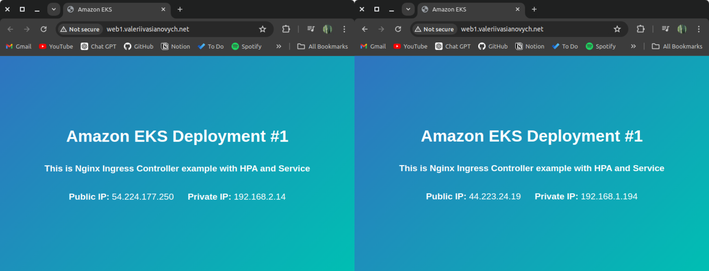
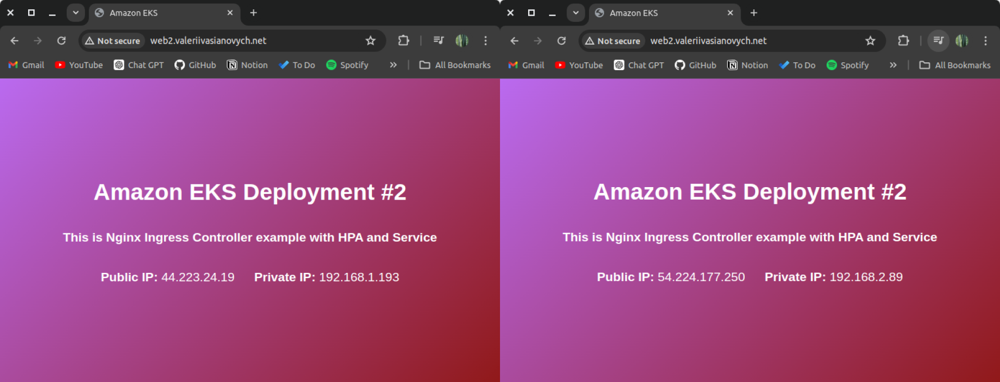

# EKS Nginx Ingress Controller

Welcome to the EKS Nginx Ingress Controller project! This repository contains deployments with a container that copies a script to fetch external and internal IP addresses and create a visually appealing web page displaying this information.

## Features

In this project, the following Kubernetes resources and AWS services are utilized:
- **Horizontal Pod Autoscaler (HPA)** for automatic scaling
- **Deployments** for managing application instances
- **Services** for stable network endpoints
- **Ingress** for routing external traffic to services
- **Amazon EKS** for Kubernetes orchestration
- **AWS Route 53** for DNS management

## Project Overview

This project demonstrates the integration of multiple Kubernetes and AWS components to deploy a scalable and reliable web application. The web page dynamically displays the external and internal IP addresses of the running containers.

### Technologies Used:
- **Kubernetes**: For container orchestration and management
- **Nginx Ingress Controller**: For managing external access to the services
- **Amazon EKS**: To run Kubernetes clusters on AWS
- **AWS Route 53**: For DNS management

### Link to NGINX Ingress Controller:
[NGINX Ingress Controller Documentation](https://kubernetes.github.io/ingress-nginx/)

## Results

Here are some screenshots showcasing the Docker Nginx:

## Future Updates

This repository will continue to be updated with new features and improvements.
